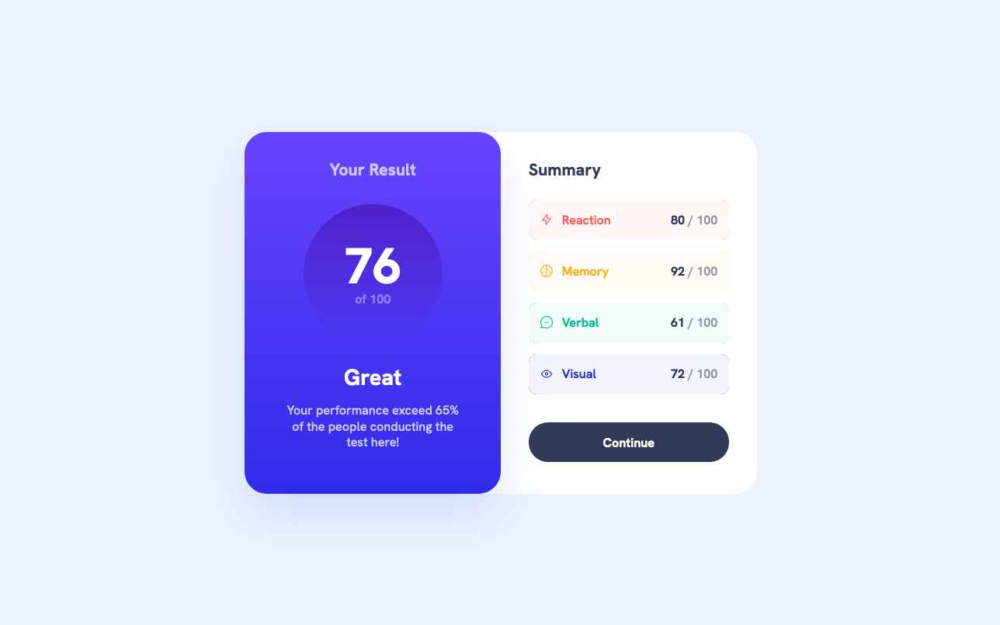

# Results summary component solution

> This is a solution to the [Results summary component challenge on Frontend Mentor](https://www.frontendmentor.io/challenges/results-summary-component-CE_K6s0maV).

A fun little project from Frontend Mentor that displays your test results in a neat, purple-themed card. Built this while learning the ropes of React and CSS!

**Tech Stack:** React (with class components), CSS for all that pretty styling, Created with create-react-app.

**Features:** Fully responsive, Clean and modern UI with a nice purple gradient, nothing else.

| [Live Demo Link](https://github.com/ionStici/results-summary-component) | [Frontend Mentor](https://www.frontendmentor.io/solutions/results-summary-component-so2M-pHih4) |
| ----------------------------------------------------------------------- | ----------------------------------------------------------------------------------------------- |

<!-- ### Primary

- Light red: hsl(0, 100%, 67%)
- Orangey yellow: hsl(39, 100%, 56%)
- Green teal: hsl(166, 100%, 37%)
- Cobalt blue: hsl(234, 85%, 45%)

## Gradients

- Light slate blue (background): hsl(252, 100%, 67%)
- Light royal blue (background): hsl(241, 81%, 54%)

- Violet blue (circle): hsla(256, 72%, 46%, 1)
- Persian blue (circle): hsla(241, 72%, 46%, 0)

### Neutral

- White: hsl(0, 0%, 100%)
- Pale blue: hsl(221, 100%, 96%)
- Light lavender: hsl(241, 100%, 89%)
- Dark gray blue: hsl(224, 30%, 27%)

### Notes

Use transparency to get the colour variations necessary to match the design. Hint: look into using `hsla()`.

### Body Copy

- Font size (paragraphs): 18px

### Font

- Family: [Hanken Grotesk](https://fonts.google.com/specimen/Hanken+Grotesk)
- Weights: 500, 700, 800 -->
